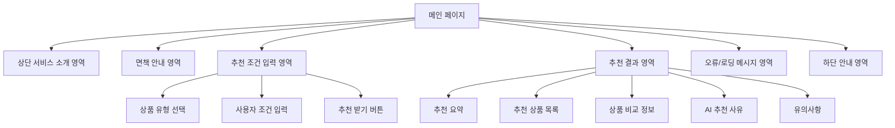
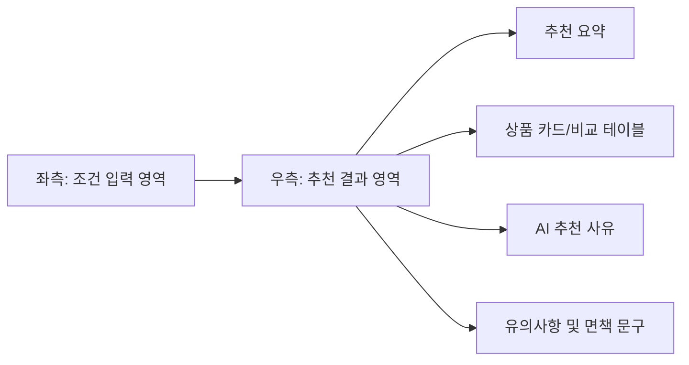
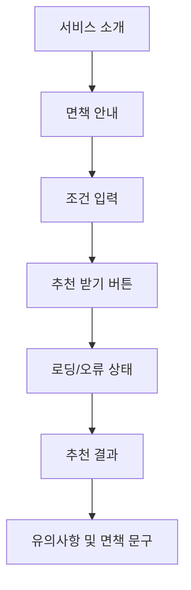

# IA.md

# 금융 상품 비교 추천 AI 에이전트 IA 설계

## 1. 문서 목적

본 문서는 Phase 1 프로젝트인 **금융 상품 비교 추천 AI 에이전트**의 화면 구조와 정보 배치를 정의한다.

`PRD.md`, `scenario.md`, `flow.md`에서 정의한 기준에 따라 Phase 1은 **폼 입력 기반 단일 페이지 추천 서비스**로 설계한다.  
AI는 자유 대화형 챗봇 입력창이 아니라, 추천 결과 영역에서 사용자가 이해하기 쉬운 **대화형 설명**을 제공한다.

---

## 2. IA 설계 기준

| 항목 | 설계 기준 |
|---|---|
| 화면 구조 | 단일 페이지 중심 |
| 입력 방식 | 폼 입력 기반 |
| 결과 표시 | 입력 영역 하단 또는 우측 결과 영역 |
| AI 역할 | 추천 요약, 상품별 추천 사유, 비교 포인트, 유의사항 설명 |
| 추천 API | `POST /api/phase1/recommendations` 단일 호출 |
| 주요 사용자 | 금융상품을 비교하려는 일반 사용자 |
| 반응형 기준 | PC 우선, 모바일 기본 대응 |
| Phase 1 제외 | 자유 대화형 챗봇 UI, 로그인, 사용자 히스토리, 관리자 화면 |

---

## 3. 전체 화면 구조

Phase 1 MVP는 화면을 과도하게 분리하지 않고, 하나의 페이지에서 조건 입력과 추천 결과 확인이 가능하도록 구성한다.



---

## 4. 화면 목록

| 화면 ID | 화면명 | 설명 | Phase 1 포함 여부 |
|---|---|---|---|
| PAGE-001 | 메인 추천 페이지 | 조건 입력과 추천 결과를 함께 제공하는 핵심 화면 | 포함 |
| PAGE-002 | 추천 결과 영역 | 추천 요청 후 동일 페이지 내에 표시되는 결과 영역 | 포함 |
| PAGE-003 | 오류/빈 결과 상태 | 입력 오류, 조회 실패, 결과 없음 안내 영역 | 포함 |
| PAGE-004 | 로딩 상태 | 상품 조회 및 AI 추천 생성 중 표시되는 상태 | 포함 |
| PAGE-005 | 사용자 히스토리 화면 | 과거 추천 결과 저장 및 조회 | 제외 |
| PAGE-006 | 관리자 화면 | 상품 데이터 또는 정책 관리 | 제외 |
| PAGE-007 | 자유 대화형 챗봇 화면 | 채팅 입력 기반 질의응답 | 제외 |

---

## 5. 메인 추천 페이지 구성

### 5.1 화면 구성 개요

| 영역 | 영역명 | 설명 | 우선순위 |
|---|---|---|---|
| A | 서비스 소개 영역 | 서비스명, 간단한 설명, 사용 목적 안내 | 상 |
| B | 면책 안내 영역 | 금융 자문이 아닌 참고용 도구임을 안내 | 상 |
| C | 추천 조건 입력 영역 | 상품 유형과 사용자 조건 입력 | 상 |
| D | 추천 실행 영역 | 추천 받기 버튼, 로딩 상태 | 상 |
| E | 추천 결과 영역 | 추천 상품, 비교 정보, AI 설명 표시 | 상 |
| F | 오류/빈 결과 영역 | 입력 오류, API 오류, 결과 없음 표시 | 중 |
| G | 하단 안내 영역 | 공식 정보 확인 안내, 데이터 출처 | 중 |

---

## 6. 추천 조건 입력 영역

### 6.1 입력 항목

| 항목 | 입력 방식 | 필수 여부 | 설명 |
|---|---|---|---|
| 상품 유형 | 버튼 선택 | 필수 | 예금 / 적금 / 대출 |
| 나이 | 숫자 직접 입력 | 필수 | 사용자 연령 |
| 자산 규모 | 금액 직접 입력 | 필수 | 예치 가능 금액 또는 필요 대출 금액 |
| 금융 목적 | 버튼 선택 또는 드롭다운 | 필수 | 목돈 마련, 여유자금 예치, 생활자금, 전세자금 등 |
| 가입 기간 | 선택지 | 선택 | 6개월 / 12개월 / 24개월 / 36개월 |
| 선호 금융권 | 체크박스 또는 드롭다운 | 선택 | 은행, 저축은행 등 |
| 위험 선호도 | 버튼 선택 | 선택 | 안정성 우선, 금리 우선, 조건 단순성 우선 |

### 6.2 상품 유형별 입력 차이

| 상품 유형 | 자산 규모 라벨 | 금융 목적 예시 | 추가 안내 |
|---|---|---|---|
| 예금 | 예치 가능 금액 | 여유자금 예치, 단기 자금 보관 | 가입 기간과 금리 비교 중심 |
| 적금 | 월 저축 가능 금액 | 목돈 마련, 저축 습관 형성 | 월 납입액과 기간 중심 |
| 대출 | 필요 대출 금액 | 생활자금, 전세자금, 긴급자금 | 승인 가능성 판단 불가 안내 필수 |

### 6.3 입력 영역 UX 기준

| 상태 | 처리 기준 |
|---|---|
| 최초 진입 | 기본 상품 유형은 미선택 상태 |
| 필수값 누락 | 해당 필드 하단에 오류 메시지 표시 |
| 숫자 형식 오류 | 금액 또는 나이 입력 오류 안내 |
| 상품 유형 변경 | 상품 유형별 라벨과 안내 문구 변경 |
| 추천 요청 중 | 입력값은 유지하되 추천 버튼 비활성화 |
| 추천 완료 후 수정 | 기존 입력값 유지, 일부 수정 후 재추천 가능 |

---

## 7. 추천 실행 영역

| 요소 | 설명 |
|---|---|
| 추천 받기 버튼 | 필수 입력값이 유효할 때 추천 요청 실행 |
| 버튼 비활성 상태 | 로딩 중 또는 필수 입력값 오류 시 비활성화 |
| 로딩 메시지 | 상품 데이터 조회 및 AI 추천 생성 중임을 안내 |
| 재시도 버튼 | API 오류 또는 AI 응답 실패 시 표시 가능 |

### 7.1 로딩 문구 예시

| 상황 | 문구 |
|---|---|
| 상품 데이터 조회 중 | 금융상품 정보를 불러오는 중입니다. |
| AI 추천 생성 중 | 조건에 맞는 추천 설명을 생성하는 중입니다. |
| 응답 지연 | 잠시만 기다려 주세요. 상품 정보와 추천 사유를 확인하고 있습니다. |

---

## 8. 추천 결과 영역

### 8.1 추천 결과 기본 구성

| 영역 | 설명 | 표시 조건 |
|---|---|---|
| 추천 요약 | 사용자 조건에 따른 전체 추천 방향 | AI 응답 성공 시 |
| 추천 상품 목록 | 최대 3~5개 상품 카드 또는 리스트 | 상품 후보 존재 시 |
| 상품 비교 정보 | 금리, 기간, 금융회사, 조건 비교 | 상품 후보 존재 시 |
| AI 추천 사유 | 상품별 추천 이유 | AI 응답 성공 시 |
| 비교 포인트 | 상품 간 차이점 요약 | AI 응답 성공 시 |
| 유의사항 | 우대조건, 금리 변동, 가입 전 확인사항 | 항상 표시 권장 |
| 면책 문구 | 금융 자문이 아닌 참고용 도구 안내 | 항상 표시 |

### 8.2 추천 상품 카드 구성

| 항목 | 설명 |
|---|---|
| 금융회사명 | 상품 제공 금융회사 |
| 상품명 | 금융상품명 |
| 상품 유형 | 예금 / 적금 / 대출 |
| 기본 금리 | 원천 데이터 기준 기본 금리 |
| 최고 우대 금리 | 제공 가능한 경우 표시 |
| 가입 기간 | 상품 가입 가능 기간 |
| 가입 방법 | 영업점, 인터넷, 모바일 등 |
| 추천 사유 | AI가 생성한 사용자 조건 기반 설명 |
| 유의사항 | 우대 조건, 확인 필요 사항 |

### 8.3 결과 영역 상태

| 상태 | 화면 처리 |
|---|---|
| 최초 진입 | 결과 영역은 비워두거나 “조건을 입력하면 추천 결과가 표시됩니다.” 안내 |
| 로딩 중 | 결과 영역에 로딩 상태 표시 |
| 추천 성공 | 추천 요약과 상품 목록 표시 |
| AI 실패 | 상품 후보는 표시하고 AI 설명 실패 안내 |
| 상품 없음 | 조건 완화 안내 |
| 오류 발생 | 오류 메시지와 재시도 안내 |

---

## 9. 오류 및 빈 결과 상태

| 오류 유형 | 표시 위치 | 사용자 메시지 |
|---|---|---|
| 필수 입력값 누락 | 입력 필드 하단 | 필수 정보를 입력해 주세요. |
| 입력 형식 오류 | 입력 필드 하단 | 숫자 형식으로 입력해 주세요. |
| 상품 데이터 조회 실패 | 결과 영역 상단 | 금융상품 정보를 불러오지 못했습니다. 잠시 후 다시 시도해 주세요. |
| 추천 가능한 상품 없음 | 결과 영역 | 현재 조건에 맞는 상품을 찾기 어렵습니다. 조건을 완화해 보세요. |
| AI 추천 생성 실패 | 결과 영역 | 상품 목록은 확인할 수 있지만, AI 추천 설명을 생성하지 못했습니다. |
| 대출 승인 질문 | 결과 영역 또는 유의사항 | 실제 승인 여부와 적용 금리는 금융회사 심사 결과에 따라 달라집니다. |

---

## 10. 면책 문구 위치

면책 문구는 다음 위치에 표시한다.

| 위치 | 표시 방식 | 필수 여부 |
|---|---|---|
| 메인 상단 | 짧은 안내 문구 | 필수 |
| 추천 결과 하단 | 상세 면책 문구 | 필수 |
| 대출 상품 결과 영역 | 대출 심사 관련 추가 안내 | 대출 선택 시 필수 |

### 10.1 짧은 면책 문구

```text
본 서비스는 금융상품 탐색을 돕는 참고용 도구입니다.
```

### 10.2 상세 면책 문구

```text
본 서비스는 금융상품 탐색을 돕기 위한 참고용 도구입니다.
제공되는 추천 결과는 금융상품 가입 권유, 투자 권유 또는 금융 자문을 목적으로 하지 않습니다.
실제 가입 전에는 반드시 해당 금융회사와 금융감독원 공시 정보를 확인하시기 바랍니다.
```

---

## 11. PC 화면 배치

PC에서는 입력 영역과 결과 영역을 한 화면에서 비교적 쉽게 볼 수 있도록 2단 구조를 우선 검토한다.



### 11.1 PC 권장 레이아웃

| 영역 | 권장 배치 |
|---|---|
| 서비스 소개 | 상단 전체 폭 |
| 면책 안내 | 서비스 소개 하단 |
| 조건 입력 | 좌측 또는 상단 |
| 추천 결과 | 우측 또는 입력 영역 하단 |
| 오류 메시지 | 입력 필드 하단 또는 결과 영역 상단 |
| 면책 문구 | 결과 영역 하단 |

---

## 12. 모바일 화면 배치

모바일에서는 세로 스크롤 구조를 우선한다.



### 12.1 모바일 권장 레이아웃

| 영역 | 권장 배치 |
|---|---|
| 서비스 소개 | 최상단 |
| 조건 입력 | 세로 폼 |
| 추천 버튼 | 입력 영역 하단 고정 또는 일반 버튼 |
| 추천 결과 | 입력 영역 아래 |
| 상품 비교 | 카드형 리스트 우선 |
| 상세 비교 테이블 | 모바일에서는 최소화 또는 가로 스크롤 |
| 면책 문구 | 결과 하단 |

---

## 13. 화면 상태 정의

| 상태 ID | 상태명 | 설명 |
|---|---|---|
| STATE-001 | 초기 상태 | 사용자가 아직 추천 요청을 하지 않은 상태 |
| STATE-002 | 입력 중 | 사용자가 조건을 입력 중인 상태 |
| STATE-003 | 입력 오류 | 필수값 누락 또는 형식 오류 상태 |
| STATE-004 | 로딩 | 추천 요청 후 응답 대기 상태 |
| STATE-005 | 추천 성공 | 상품 후보와 AI 추천 설명이 정상 표시된 상태 |
| STATE-006 | 상품 없음 | 조건에 맞는 상품 후보가 없는 상태 |
| STATE-007 | 상품 조회 실패 | 금융 API 또는 캐시 조회 실패 상태 |
| STATE-008 | AI 설명 실패 | 상품 후보는 있으나 AI 설명 생성에 실패한 상태 |
| STATE-009 | 재입력 | 추천 결과 확인 후 조건을 수정하는 상태 |

---

## 14. Phase 1 제외 화면

| 화면 | 제외 사유 |
|---|---|
| 로그인/회원가입 | 개인화 저장 기능이 Phase 1 범위가 아님 |
| 추천 결과 히스토리 | 저장 기능은 Phase 1 이후 검토 |
| 관리자 화면 | MVP에서는 외부 API와 캐시 데이터 중심으로 처리 |
| 자유 대화형 챗봇 화면 | Phase 1은 폼 입력 기반 추천으로 범위 제한 |
| 상세 상품 페이지 | 원천 금융회사 또는 공시 정보 확인 안내로 대체 |

---

## 15. 후속 문서 반영 사항

| 문서 | 반영 필요 내용 |
|---|---|
| api-spec.md | 입력 항목, 상태별 응답, 오류 코드 정의 |
| data-definition.md | 화면 입력값과 API 요청/응답 데이터 구조 정의 |
| ai-policy.md | 추천 결과 영역에서 사용할 AI 표현 정책 정의 |
| README.md | 포트폴리오 소개와 실제 화면 개요 반영 가능 |

---
