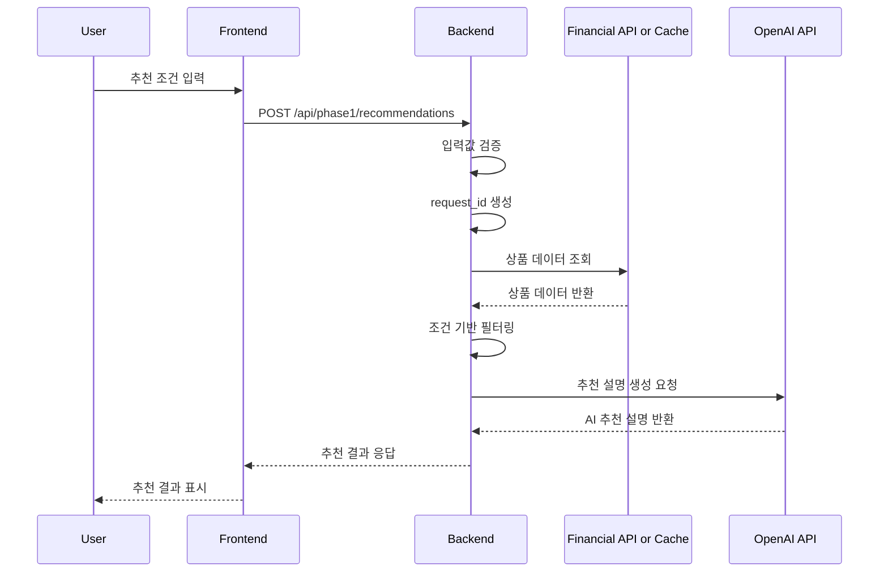

# api-spec.md

# 금융 상품 비교 추천 AI 에이전트 API 명세

## 1. 문서 목적

본 문서는 Phase 1의 API 계약을 정의한다. Phase 1에서는 `POST /api/phase1/recommendations` 단일 추천 API를 중심으로 사용자 입력값 검증, 금융상품 데이터 조회 또는 캐시 조회, 조건 기반 상품 후보 필터링, AI 추천 설명 생성을 하나의 흐름으로 처리한다.

본 문서는 백엔드 구현 전 프론트엔드와 백엔드가 공유할 요청/응답 구조, 오류 처리 기준, 보안 기준, Phase 1 제외 API 범위를 명확히 하기 위한 기준 문서다.

---

## 2. API 설계 기준

| 항목 | 기준 |
|---|---|
| API 스타일 | REST |
| 요청 형식 | JSON |
| 응답 형식 | JSON |
| 핵심 API | `POST /api/phase1/recommendations` |
| 인증 | Phase 1에서는 사용자 인증 없음 |
| 사용자 데이터 저장 | Phase 1에서는 저장하지 않음 |
| 외부 API | 금융감독원 금융상품통합비교공시 API |
| AI API | OpenAI API |
| OpenAI 호출 모듈 | `shared/openai_client.py` |
| 배포 제약 | Render Free 티어 고려 |
| 호출 최소화 | 프론트엔드 추천 요청 1회당 백엔드 API 1회 호출 |

---

## 3. API 목록

| Method | Endpoint | 설명 | Phase 1 포함 여부 |
|---|---|---|---|
| GET | `/health` | 서버 상태 확인 | 포함 |
| POST | `/api/phase1/recommendations` | 사용자 조건 기반 금융상품 추천 | 포함 |
| GET | `/api/phase1/products` | 상품 데이터 직접 조회 | 제외 또는 내부 검토 |
| POST | `/api/phase1/ai-summary` | AI 요약 단독 생성 | 제외 |
| GET | `/api/phase1/history` | 추천 결과 히스토리 조회 | 제외 |

`GET /api/phase1/products`는 Phase 1 구현에서 반드시 만들 필요는 없으며, 디버깅 또는 내부 검토용으로만 후순위 처리한다.

---

## 4. 공통 요청/응답 기준

- 모든 요청/응답은 JSON 기준으로 한다.
- 날짜/시간이 필요한 경우 ISO 8601 문자열을 사용한다.
- 금액은 숫자 타입으로 전달한다.
- 금리는 숫자 타입 또는 문자열 타입을 허용하되, 응답에서는 표시용 문자열을 함께 제공할 수 있다.
- 사용자 입력값은 서버에서 다시 검증한다.
- 오류 발생 시 `error_code`, `message`, `details` 구조를 사용한다.
- `request_id`는 프론트엔드가 전달하지 않고 백엔드에서 생성한다.
- `request_id`는 추천 요청 단위의 식별자로 사용하며, Phase 1에서는 DB 저장 없이 응답 추적용 값으로만 사용한다.
- 금융상품 가입 권유, 금융 자문, 대출 승인 단정 표현은 응답에 포함하지 않는다.

---

## 5. 추천 API 상세

### 5.1 기본 정보

| 항목 | 내용 |
|---|---|
| Method | POST |
| Endpoint | `/api/phase1/recommendations` |
| Content-Type | `application/json` |
| 설명 | 사용자 조건을 기반으로 금융상품 후보를 조회·필터링하고 AI 추천 설명을 생성한다. |

### 5.2 처리 순서



---

## 6. 요청 Body 정의

### 6.1 요청 예시

```json
{
  "product_type": "saving",
  "age": 29,
  "amount": 500000,
  "saving_period_months": 12,
  "financial_goal": "목돈 마련",
  "preferred_institutions": ["bank"],
  "risk_preference": "stability"
}
```

### 6.2 요청 필드 정의

| 필드명 | 타입 | 필수 | 설명 | 허용값/예시 |
|---|---|---|---|---|
| `product_type` | string | Y | 상품 유형 | `deposit`, `saving`, `loan` |
| `age` | number | Y | 사용자 나이 | `29` |
| `amount` | number | Y | 상품 유형별 기준 금액 | `500000` |
| `saving_period_months` | number | N | 가입 또는 이용 기간 | `6`, `12`, `24`, `36` |
| `financial_goal` | string | Y | 금융 목적 | 목돈 마련, 여유자금 예치, 생활자금, 전세자금 |
| `preferred_institutions` | array | N | 선호 금융권 | `["bank"]`, `["savings_bank"]` |
| `risk_preference` | string | N | 선호 기준 | `stability`, `rate`, `simplicity` |

### 6.3 상품 유형 값

| 값 | 의미 |
|---|---|
| `deposit` | 예금 |
| `saving` | 적금 |
| `loan` | 대출 |

### 6.4 `amount` 필드 의미

| `product_type` | `amount` 의미 |
|---|---|
| `deposit` | 예치 가능 금액 |
| `saving` | 월 저축 가능 금액 |
| `loan` | 필요 대출 금액 |

### 6.5 선호 금융권 값

| 값 | 의미 |
|---|---|
| `bank` | 은행 |
| `savings_bank` | 저축은행 |
| `all` | 전체 |

### 6.6 위험 선호도 값

| 값 | 의미 |
|---|---|
| `stability` | 안정성 우선 |
| `rate` | 금리 우선 |
| `simplicity` | 조건 단순성 우선 |

---

## 7. 응답 Body 정의

### 7.1 성공 응답 예시

```json
{
  "request_id": "rec_20260513_0001",
  "product_type": "saving",
  "status": "success",
  "summary": "입력하신 조건에서는 12개월 기준의 안정적인 적금 상품을 우선 비교하는 것이 적합합니다.",
  "recommended_products": [
    {
      "rank": 1,
      "company_name": "예시은행",
      "product_name": "예시 적금",
      "product_type": "saving",
      "base_rate": 3.2,
      "max_rate": 4.1,
      "period_months": 12,
      "join_way": "인터넷, 모바일",
      "recommendation_reason": "월 저축 가능 금액과 12개월 목돈 마련 목적에 비교적 적합한 상품입니다.",
      "cautions": [
        "우대금리 조건 충족 여부를 가입 전 확인해야 합니다.",
        "금리와 상품 조건은 변경될 수 있습니다."
      ]
    }
  ],
  "comparison_points": [
    "최고 우대금리보다 실제 충족 가능한 우대조건을 함께 확인해야 합니다.",
    "가입 기간이 동일한 상품끼리 비교하는 것이 적절합니다."
  ],
  "disclaimer": "본 서비스는 금융상품 탐색을 돕기 위한 참고용 도구이며, 금융상품 가입 권유 또는 금융 자문을 목적으로 하지 않습니다.",
  "source": {
    "provider": "금융감독원 금융상품통합비교공시 API",
    "fetched_at": "2026-05-13T10:00:00+09:00"
  }
}
```

### 7.2 응답 필드 정의

| 필드명 | 타입 | 설명 |
|---|---|---|
| `request_id` | string | 백엔드에서 생성하는 추천 요청 식별자 |
| `product_type` | string | 요청한 상품 유형 |
| `status` | string | 처리 결과 상태 |
| `summary` | string/null | AI 추천 요약 |
| `recommended_products` | array | 추천 상품 목록 |
| `comparison_points` | array | 상품 비교 포인트 |
| `disclaimer` | string | 면책 문구 |
| `source` | object | 데이터 출처 정보 |
| `error` | object/null | 부분 성공 또는 오류 발생 시 오류 정보 |

### 7.3 `status` 값

| 값 | 의미 |
|---|---|
| `success` | 상품 후보 조회와 AI 추천 설명 생성 모두 성공 |
| `partial_success` | 상품 후보 조회는 성공했으나 AI 추천 설명 생성 실패 |
| `error` | 추천 요청 처리 실패 |

### 7.4 `recommended_products` 하위 필드 정의

| 필드명 | 타입 | 설명 |
|---|---|---|
| `rank` | number | 추천 순위 |
| `company_name` | string | 금융회사명 |
| `product_name` | string | 상품명 |
| `product_type` | string | 상품 유형 |
| `base_rate` | number/null | 기본 금리 |
| `max_rate` | number/null | 최고 우대 금리 |
| `period_months` | number/null | 가입 기간 |
| `join_way` | string/null | 가입 방법 |
| `recommendation_reason` | string/null | 추천 사유 |
| `cautions` | array | 유의사항 |

---

## 8. 오류 응답 정의

### 8.1 공통 오류 응답 구조

```json
{
  "status": "error",
  "error_code": "VALIDATION_ERROR",
  "message": "필수 입력값을 확인해 주세요.",
  "details": [
    {
      "field": "product_type",
      "reason": "상품 유형은 필수입니다."
    }
  ]
}
```

### 8.2 오류 코드

| HTTP Status | `error_code` | 설명 | 사용자 메시지 |
|---|---|---|---|
| 400 | `VALIDATION_ERROR` | 필수값 누락 또는 입력값 형식 오류 | 필수 정보를 확인해 주세요. |
| 400 | `INVALID_PRODUCT_TYPE` | 지원하지 않는 상품 유형 | 지원하지 않는 상품 유형입니다. |
| 404 | `NO_RECOMMENDABLE_PRODUCTS` | 조건에 맞는 상품 없음 | 현재 조건에 맞는 상품을 찾기 어렵습니다. |
| 502 | `FINANCIAL_API_ERROR` | 금융상품 데이터 조회 실패 | 금융상품 정보를 불러오지 못했습니다. |
| 502 | `OPENAI_API_ERROR` | AI 추천 설명 생성 실패 | AI 추천 설명을 생성하지 못했습니다. |
| 500 | `INTERNAL_SERVER_ERROR` | 서버 내부 오류 | 일시적인 오류가 발생했습니다. |

### 8.3 AI 실패 시 부분 성공 응답 구조

AI 실패 시에는 가능한 경우 상품 후보는 표시할 수 있도록 `partial_success` 응답을 반환한다.

```json
{
  "request_id": "rec_20260513_0002",
  "product_type": "deposit",
  "status": "partial_success",
  "summary": null,
  "recommended_products": [
    {
      "rank": 1,
      "company_name": "예시은행",
      "product_name": "예시 예금",
      "product_type": "deposit",
      "base_rate": 3.1,
      "max_rate": 3.8,
      "period_months": 12,
      "join_way": "인터넷",
      "recommendation_reason": null,
      "cautions": []
    }
  ],
  "comparison_points": [],
  "disclaimer": "본 서비스는 금융상품 탐색을 돕기 위한 참고용 도구입니다.",
  "error": {
    "error_code": "OPENAI_API_ERROR",
    "message": "상품 목록은 확인할 수 있지만, AI 추천 설명을 생성하지 못했습니다."
  }
}
```

`partial_success`는 금융상품 데이터 조회와 상품 후보 필터링은 성공했으나, OpenAI API 호출 또는 AI 응답 파싱이 실패한 경우에 반환한다.

단, 금융상품 데이터 조회 자체가 실패한 경우에는 `partial_success`가 아니라 `FINANCIAL_API_ERROR` 오류 응답을 반환한다.

---

## 9. 상품 유형별 처리 기준

| 상품 유형 | 처리 기준 | 주의사항 |
|---|---|---|
| 예금 | 예치 금액, 가입 기간, 금리 기준으로 비교 | 중도해지, 우대조건 확인 필요 |
| 적금 | 월 저축 가능 금액, 가입 기간, 금리 기준으로 비교 | 월 납입 조건, 우대조건 확인 필요 |
| 대출 | 필요 금액, 목적, 금리 범위, 상환 방식 기준으로 탐색 | 승인 가능성, 실제 한도, 개인별 금리 단정 금지 |

대출 상품은 Phase 1에서 제한적 탐색 기능으로 다룬다. 대출 승인 가능성, 실제 한도, 개인별 적용 금리는 판단하거나 단정하지 않는다.

---

## 10. AI 응답 처리 기준

- AI는 조회된 상품 후보와 사용자 조건을 기반으로만 설명한다.
- AI는 상품 정보를 임의로 생성하지 않는다.
- AI는 금융상품 가입을 권유하지 않는다.
- AI는 "가장 좋다", "무조건 유리하다", "승인 가능하다" 같은 단정 표현을 사용하지 않는다.
- AI 응답 실패 시 상품 후보 목록은 가능한 경우 표시한다.
- OpenAI API 호출 또는 AI 응답 파싱 실패 시 `partial_success`로 처리할 수 있다.
- 상세 정책은 `docs/phase1/ai-policy.md`에서 정의한다.

---

## 11. 캐시 및 외부 API 호출 기준

- Render Free 티어와 외부 API 호출량을 고려해 캐시 사용을 우선 검토한다.
- Phase 1에서는 파일 캐시 또는 단순 메모리 캐시를 우선 검토한다.
- 추천 요청 1회마다 금융 API와 OpenAI API를 무조건 반복 호출하지 않도록 한다.
- 캐시 데이터 사용 시 응답의 `source.fetched_at`에 데이터 조회 시점을 포함한다.
- 캐시 정책의 상세 구현은 백엔드 구현 단계에서 확정한다.

---

## 12. 보안 및 환경변수 기준

### 12.1 환경변수

| 환경변수 | 설명 | 필수 여부 |
|---|---|---|
| `OPENAI_API_KEY` | OpenAI API Key | 필수 |
| `OPENAI_MODEL` | 사용할 OpenAI 모델명 | 선택 |
| `FSS_API_KEY` | 금융감독원 금융상품통합비교공시 API Key | 필수 |
| `APP_ENV` | 실행 환경 | 선택 |
| `LOG_LEVEL` | 로그 레벨 | 선택 |

### 12.2 보안 기준

- `.env` 파일은 Git에 커밋하지 않는다.
- API Key는 코드에 직접 작성하지 않는다.
- 사용자 입력값 중 민감한 정보는 저장하지 않는다.
- Phase 1에서는 주민등록번호, 신용점수, 계좌정보 등 민감정보를 받지 않는다.

---

## 13. Phase 1 제외 API

| API | 제외 사유 |
|---|---|
| 사용자 로그인 API | Phase 1에서는 사용자 저장 기능 없음 |
| 추천 히스토리 API | 추천 결과 저장 제외 |
| 관리자 API | MVP 범위 초과 |
| 자유 대화형 챗봇 API | Phase 1은 폼 입력 기반 추천 |
| 대출 승인 예측 API | 금융 자문 및 승인 판단 위험 |

별도 `POST /api/phase1/ai-summary` API는 Phase 1에서 만들지 않는다. AI 요약은 `POST /api/phase1/recommendations` 내부 처리 흐름에 포함한다.

---

## 14. 후속 구현 참고 사항

- 백엔드 구현 전 `data-definition.md`와 함께 요청/응답 필드를 재확인한다.
- OpenAI 호출은 반드시 `shared/openai_client.py`를 통해 처리한다.
- 추천 API는 mock 응답부터 구현한 뒤 실제 OpenAI 호출을 연결한다.
- 금융감독원 API 연동 실패에 대비해 샘플 데이터 또는 캐시 데이터를 준비한다.
- 프론트엔드는 `IA.md`의 상태 정의를 기준으로 로딩, 오류, 결과 없음, 부분 성공 상태를 처리한다.
- `request_id`는 백엔드에서 생성하며, Phase 1에서는 저장 없이 응답 추적용으로 사용한다.
