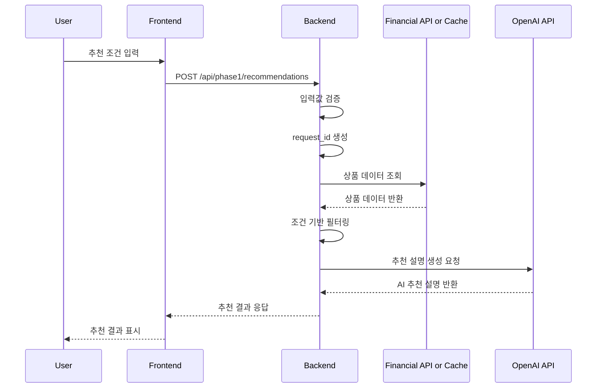

## AI Provider 선택 기준

Phase 1 추천 API는 환경변수 `AI_PROVIDER`로 AI 응답 생성 방식을 선택한다.

| 값 | 설명 |
|---|---|
| `mock` | mock AI 응답 사용 |
| `openai` | 실제 OpenAI API 호출 |

기본값은 `mock`이다.

`AI_PROVIDER=openai`일 때 `OPENAI_API_KEY`가 없거나 OpenAI 호출에 실패하면 추천 API는 `partial_success`를 반환한다.

FSS 데이터 조회 실패는 `FINANCIAL_API_ERROR`이고, OpenAI 설명 생성 실패는 `partial_success`다.

# api-spec.md

# 금융 상품 비교 추천 AI 에이전트 API 명세

## 1. 문서 목적

본 문서는 Phase 1의 API 계약을 정의한다. Phase 1에서는 `POST /api/phase1/recommendations` 단일 추천 API를 중심으로 사용자 입력값 검증, 금융상품 데이터 조회 또는 캐시 조회, 조건 기반 상품 후보 필터링, AI 추천 설명 생성을 하나의 흐름으로 처리한다.

본 문서는 백엔드 구현 전 프론트엔드와 백엔드가 공유할 요청/응답 구조, 오류 처리 기준, 보안 기준, Phase 1 제외 API 범위를 명확히 하기 위한 기준 문서다.

---

## 2. API 설계 기준

| 항목 | 기준 |
|---|---|
| API 스타일 | REST |
| 요청 형식 | JSON |
| 응답 형식 | JSON |
| 핵심 API | `POST /api/phase1/recommendations` |
| 인증 | Phase 1에서는 사용자 인증 없음 |
| 사용자 데이터 저장 | Phase 1에서는 저장하지 않음 |
| 외부 API | 금융감독원 금융상품통합비교공시 API |
| AI API | OpenAI API |
| OpenAI 호출 모듈 | `shared/openai_client.py` |
| 배포 제약 | Render Free 티어 고려 |
| 호출 최소화 | 프론트엔드 추천 요청 1회당 백엔드 API 1회 호출 |

---

## 3. API 목록

| Method | Endpoint | 설명 | Phase 1 포함 여부 |
|---|---|---|---|
| GET | `/health` | 서버 상태 확인 | 포함 |
| POST | `/api/phase1/recommendations` | 사용자 조건 기반 금융상품 추천 | 포함 |
| GET | `/api/phase1/products` | 상품 데이터 직접 조회 | 제외 또는 내부 검토 |
| POST | `/api/phase1/ai-summary` | AI 요약 단독 생성 | 제외 |
| GET | `/api/phase1/history` | 추천 결과 히스토리 조회 | 제외 |

`GET /api/phase1/products`는 Phase 1 구현에서 반드시 만들 필요는 없으며, 디버깅 또는 내부 검토용으로만 후순위 처리한다.

---

## 4. 공통 요청/응답 기준

- 모든 요청/응답은 JSON 기준으로 한다.
- 날짜/시간이 필요한 경우 ISO 8601 문자열을 사용한다.
- 금액은 숫자 타입으로 전달한다.
- 금리는 숫자 타입 또는 문자열 타입을 허용하되, 응답에서는 표시용 문자열을 함께 제공할 수 있다.
- 사용자 입력값은 서버에서 다시 검증한다.
- 오류 발생 시 `error_code`, `message`, `details` 구조를 사용한다.
- `request_id`는 프론트엔드가 전달하지 않고 백엔드에서 생성한다.
- `request_id`는 추천 요청 단위의 식별자로 사용하며, Phase 1에서는 DB 저장 없이 응답 추적용 값으로만 사용한다.
- 금융상품 가입 권유, 금융 자문, 대출 승인 단정 표현은 응답에 포함하지 않는다.

---

## 5. 추천 API 상세

### 5.1 기본 정보

| 항목 | 내용 |
|---|---|
| Method | POST |
| Endpoint | `/api/phase1/recommendations` |
| Content-Type | `application/json` |
| 설명 | 사용자 조건을 기반으로 금융상품 후보를 조회·필터링하고 AI 추천 설명을 생성한다. |

### 5.2 처리 순서



---

## 6. 요청 Body 정의

### 6.1 요청 예시

```json
{
  "product_type": "saving",
  "age": 29,
  "amount": 500000,
  "saving_period_months": 12,
  "financial_goal": "lump_sum",
  "preferred_institutions": ["bank"]
}
```

### 6.2 요청 필드 정의

| 필드명 | 타입 | 필수 | 설명 | 허용값/예시 |
|---|---|---|---|---|
| `product_type` | string | Y | 상품 유형 | `deposit`, `saving`, `loan` |
| `age` | number | Y | 사용자 나이 | `29` |
| `amount` | number | Y | 상품 유형별 기준 금액 | `500000` |
| `saving_period_months` | number | N | 가입 또는 이용 기간 | `6`, `12`, `24`, `36` |
| `financial_goal` | string | Y | 금융 목적. 고정 선택지 enum. 금감원 API 필터링 파라미터로 사용하지 않고, AI 추천 설명의 컨텍스트와 상품 유형 매핑 힌트로 사용한다. | `lump_sum`, `idle_funds`, `living_expenses`, `jeonse`, `emergency` |
| `preferred_institutions` | array | N | 선호 금융권역 | `["bank"]`, `["savings_bank"]`, `["all"]` |

`financial_goal`은 금융감독원 금융상품통합비교공시 API의 직접 필터링 파라미터로 사용하지 않는다. 백엔드에서는 사용자 입력 조건의 의미를 해석하는 보조 값으로 사용하며, AI 추천 설명 생성 시 프롬프트 컨텍스트로 전달한다. 또한 `product_type`과 `financial_goal`의 조합이 자연스러운지 판단하는 힌트로 활용한다.

Phase 1 MVP에서는 `risk_preference`를 요청 필드에서 제외한다. 안정성, 금리 우선, 조건 단순성 우선은 실제 필터링 기준을 명확히 분리하기 어렵고, 구현 복잡도 대비 효과가 낮기 때문이다. Phase 1에서는 `preferred_institutions`, `saving_period_months`, 금리 정렬 기준으로 추천 후보를 구성한다. 단, 금리 기준 정렬은 내부 처리 기준으로 유지한다.

### 6.3 상품 유형 값

| 값 | 의미 |
|---|---|
| `deposit` | 예금 |
| `saving` | 적금 |
| `loan` | 대출 |

### 6.4 `amount` 필드 의미

| `product_type` | `amount` 의미 |
|---|---|
| `deposit` | 예치 가능 금액 |
| `saving` | 월 저축 가능 금액 |
| `loan` | 필요 대출 금액 |

### 6.5 `financial_goal` 값

| 값 | 화면 표시명 | 의미 | 우선 상품 유형 |
|---|---|---|---|
| `lump_sum` | 목돈 마련 | 일정 기간 동안 저축해 목돈을 만들고자 하는 목적 | `saving` |
| `idle_funds` | 여유자금 예치 | 보유 자금을 일정 기간 예치하고자 하는 목적 | `deposit` |
| `living_expenses` | 생활자금 | 생활비 또는 일반 자금 마련 목적 | `loan` |
| `jeonse` | 전세자금 | 전세보증금 또는 주거 관련 자금 마련 목적 | `loan` |
| `emergency` | 비상금 | 단기 비상자금 확보 또는 보관 목적 | `saving` 또는 `deposit` |

우선 상품 유형은 백엔드에서 `product_type`과 `financial_goal`의 조합을 해석하는 기준으로 활용한다. 단, Phase 1에서는 불일치 조합을 오류로 강제 차단하지 않는다. 불일치 가능성이 있는 경우 AI 프롬프트에 “입력 조건 간 불일치가 있을 수 있음”을 포함해 사용자에게 자연스럽게 안내한다.

### 6.6 `preferred_institutions` 값과 금융권역 매핑

| 값 | 화면 표시명 | 금융권역 | 제1/2금융권 구분 | `topFinGrpNo` |
|---|---|---|---|---|
| `bank` | 은행 | 은행권 | 제1금융권 | `020000` |
| `savings_bank` | 저축은행 | 저축은행권 | 제2금융권 | 공식 API 상세 또는 실제 호출 테스트 후 확정 |
| `all` | 전체 | 은행권 + 저축은행권 | 제1금융권 + 제2금융권 | `020000` + 저축은행 코드 |

`topFinGrpNo`는 금융감독원 금융상품통합비교공시 API 호출 시 사용하는 금융권역 코드다. Phase 1에서는 은행권(`020000`)을 기본 조회 대상으로 한다. 저축은행 코드는 공식 API 상세 또는 실제 API 호출 테스트로 확인한 뒤 구현 단계에서 확정한다.

---

## 7. 응답 Body 정의

### 7.1 성공 응답 예시

```json
{
  "request_id": "rec_20260513_0001",
  "product_type": "saving",
  "status": "success",
  "summary": "입력하신 조건에서는 12개월 기준의 안정적인 적금 상품을 우선 비교하는 것이 적합합니다.",
  "recommended_products": [
    {
      "rank": 1,
      "company_name": "예시은행",
      "financial_sector": "first_sector",
      "financial_sector_name": "제1금융권",
      "top_fin_grp_no": "020000",
      "product_name": "예시 적금",
      "product_type": "saving",
      "base_rate": 3.2,
      "max_rate": 4.1,
      "period_months": 12,
      "join_way": "인터넷, 모바일",
      "recommendation_reason": "월 저축 가능 금액과 12개월 목돈 마련 목적에 비교적 적합한 상품입니다.",
      "cautions": [
        "우대금리 조건 충족 여부를 가입 전 확인해야 합니다.",
        "금리와 상품 조건은 변경될 수 있습니다."
      ]
    }
  ],
  "comparison_points": [
    "최고 우대금리보다 실제 충족 가능한 우대조건을 함께 확인해야 합니다.",
    "가입 기간이 동일한 상품끼리 비교하는 것이 적절합니다."
  ],
  "disclaimer": "본 서비스는 금융상품 탐색을 돕기 위한 참고용 도구이며, 금융상품 가입 권유 또는 금융 자문을 목적으로 하지 않습니다.",
  "source": {
    "provider": "금융감독원 금융상품통합비교공시 API",
    "fetched_at": "2026-05-13T10:00:00+09:00"
  }
}
```

### 7.2 응답 필드 정의

| 필드명 | 타입 | 설명 |
|---|---|---|
| `request_id` | string | 백엔드에서 생성하는 추천 요청 식별자 |
| `product_type` | string | 요청한 상품 유형 |
| `status` | string | 처리 결과 상태 |
| `summary` | string/null | AI 추천 요약 |
| `recommended_products` | array | 추천 상품 목록 |
| `comparison_points` | array | 상품 비교 포인트 |
| `disclaimer` | string | 면책 문구 |
| `source` | object | 데이터 출처 정보 |
| `error` | object/null | 부분 성공 또는 오류 발생 시 오류 정보 |

### 7.3 `status` 값

| 값 | 의미 |
|---|---|
| `success` | 상품 후보 조회와 AI 추천 설명 생성 모두 성공 |
| `partial_success` | 상품 후보 조회는 성공했으나 AI 추천 설명 생성 실패 |
| `error` | 추천 요청 처리 실패 |

### 7.4 `recommended_products` 하위 필드 정의

| 필드명 | 타입 | 설명 |
|---|---|---|
| `rank` | number | 추천 순위 |
| `company_name` | string | 금융회사명. 금감원 API의 `kor_co_nm` 값을 매핑 |
| `financial_sector` | string | 금융권역 구분. 예: `first_sector`, `second_sector` |
| `financial_sector_name` | string | 화면 표시용 금융권역명. 예: 제1금융권, 제2금융권 |
| `top_fin_grp_no` | string/null | 금감원 API 금융권역 코드 |
| `product_name` | string | 상품명 |
| `product_type` | string | 상품 유형 |
| `base_rate` | number/null | 기본 금리 |
| `max_rate` | number/null | 최고 우대 금리 |
| `period_months` | number/null | 가입 기간 |
| `join_way` | string/null | 가입 방법 |
| `recommendation_reason` | string/null | 추천 사유 |
| `cautions` | array | 유의사항 |

---

## 8. 오류 응답 정의

### 8.1 공통 오류 응답 구조

```json
{
  "status": "error",
  "error_code": "VALIDATION_ERROR",
  "message": "필수 입력값을 확인해 주세요.",
  "details": [
    {
      "field": "product_type",
      "reason": "상품 유형은 필수입니다."
    }
  ]
}
```

### 8.2 오류 코드

| HTTP Status | `error_code` | 설명 | 사용자 메시지 |
|---|---|---|---|
| 400 | `VALIDATION_ERROR` | 필수값 누락 또는 입력값 형식 오류 | 필수 정보를 확인해 주세요. |
| 400 | `INVALID_PRODUCT_TYPE` | 지원하지 않는 상품 유형 | 지원하지 않는 상품 유형입니다. |
| 404 | `NO_RECOMMENDABLE_PRODUCTS` | 조건에 맞는 상품 없음 | 현재 조건에 맞는 상품을 찾기 어렵습니다. |
| 502 | `FINANCIAL_API_ERROR` | 금융상품 데이터 조회 실패 | 금융상품 정보를 불러오지 못했습니다. |
| 502 | `OPENAI_API_ERROR` | AI 추천 설명 생성 실패 | AI 추천 설명을 생성하지 못했습니다. |
| 500 | `INTERNAL_SERVER_ERROR` | 서버 내부 오류 | 일시적인 오류가 발생했습니다. |

### 8.3 AI 실패 시 부분 성공 응답 구조

AI 실패 시에는 가능한 경우 상품 후보는 표시할 수 있도록 `partial_success` 응답을 반환한다.

```json
{
  "request_id": "rec_20260513_0002",
  "product_type": "deposit",
  "status": "partial_success",
  "summary": null,
  "recommended_products": [
    {
      "rank": 1,
      "company_name": "예시은행",
      "financial_sector": "first_sector",
      "financial_sector_name": "제1금융권",
      "top_fin_grp_no": "020000",
      "product_name": "예시 예금",
      "product_type": "deposit",
      "base_rate": 3.1,
      "max_rate": 3.8,
      "period_months": 12,
      "join_way": "인터넷",
      "recommendation_reason": null,
      "cautions": []
    }
  ],
  "comparison_points": [],
  "disclaimer": "본 서비스는 금융상품 탐색을 돕기 위한 참고용 도구입니다.",
  "error": {
    "error_code": "OPENAI_API_ERROR",
    "message": "상품 목록은 확인할 수 있지만, AI 추천 설명을 생성하지 못했습니다."
  }
}
```

`partial_success`는 금융상품 데이터 조회와 상품 후보 필터링은 성공했으나, OpenAI API 호출 또는 AI 응답 파싱이 실패한 경우에 반환한다.

단, 금융상품 데이터 조회 자체가 실패한 경우에는 `partial_success`가 아니라 `FINANCIAL_API_ERROR` 오류 응답을 반환한다.

---

## 9. 상품 유형별 처리 기준

| 상품 유형 | 처리 기준 | 주의사항 |
|---|---|---|
| 예금 | 예치 금액, 가입 기간, 금리 기준으로 비교 | 중도해지, 우대조건 확인 필요 |
| 적금 | 월 저축 가능 금액, 가입 기간, 금리 기준으로 비교 | 월 납입 조건, 우대조건 확인 필요 |
| 대출 | 필요 금액, 목적, 금리 범위, 상환 방식 기준으로 탐색 | 승인 가능성, 실제 한도, 개인별 금리 단정 금지 |

예금과 적금은 금융권역별로 `topFinGrpNo`를 달리하여 조회한다. Phase 1에서는 은행권을 기본 대상으로 하고, 저축은행권은 선택 옵션 또는 후순위 확장 대상으로 둔다.

대출 상품은 예금/적금과 API 엔드포인트 및 응답 구조가 다를 수 있으므로 Phase 1에서는 제한적 탐색 기능으로 다룬다. 대출 승인 가능성, 실제 한도, 개인별 적용 금리는 판단하거나 단정하지 않는다.

### 9.1 `product_type`과 `financial_goal` 조합 기준

| `product_type` | 적합한 `financial_goal` | 부적합 가능성이 있는 예시 |
|---|---|---|
| `saving` | `lump_sum`, `emergency` | `living_expenses`, `jeonse` |
| `deposit` | `idle_funds`, `emergency` | `living_expenses`, `jeonse` |
| `loan` | `living_expenses`, `jeonse` | `lump_sum`, `idle_funds` |

Phase 1에서는 `product_type`과 `financial_goal` 조합이 다소 불일치하더라도 요청을 오류로 차단하지 않는다. 대신 백엔드는 AI 프롬프트에 입력 조건 간 불일치 가능성을 포함하고, AI는 사용자에게 조건을 다시 확인해 볼 수 있도록 안내한다.

예를 들어 `product_type: saving`과 `financial_goal: living_expenses` 조합은 일반적으로 적금 추천 목적과 맞지 않을 수 있다. 이 경우 시스템은 추천을 중단하지 않고, 생활자금 목적이라면 대출 상품 탐색이 더 적합할 수 있다는 안내를 포함할 수 있다.

강제 차단 또는 자동 상품 유형 전환은 Phase 2 이후 검토한다.

---

## 10. AI 응답 처리 기준

- AI는 조회된 상품 후보와 사용자 조건을 기반으로만 설명한다.
- AI는 상품 정보를 임의로 생성하지 않는다.
- AI는 금융상품 가입을 권유하지 않는다.
- AI는 "가장 좋다", "무조건 유리하다", "승인 가능하다" 같은 단정 표현을 사용하지 않는다.
- AI 응답 실패 시 상품 후보 목록은 가능한 경우 표시한다.
- OpenAI API 호출 또는 AI 응답 파싱 실패 시 `partial_success`로 처리할 수 있다.
- 상세 정책은 `docs/phase1/ai-policy.md`에서 정의한다.

---

## 11. 캐시 및 외부 API 호출 기준

- Render Free 티어와 외부 API 호출량을 고려해 캐시 사용을 우선 검토한다.
- Phase 1에서는 파일 캐시 또는 단순 메모리 캐시를 우선 검토한다.
- 추천 요청 1회마다 금융 API와 OpenAI API를 무조건 반복 호출하지 않도록 한다.
- 캐시 데이터 사용 시 응답의 `source.fetched_at`에 데이터 조회 시점을 포함한다.
- Phase 1 기본 조회값은 `preferred_institutions: ["bank"]`로 설정해 은행권 단일 조회를 우선한다.
- `preferred_institutions`가 `["bank"]`이면 은행권 `topFinGrpNo=020000`만 조회한다.
- `preferred_institutions`가 `["savings_bank"]`이면 저축은행권만 조회한다. 단, 저축은행 `topFinGrpNo`는 공식 API 상세 또는 실제 호출 테스트 후 확정한다.
- `preferred_institutions`가 `["all"]`이면 은행권과 저축은행권을 순차 조회한다.
- `all` 조회는 최소 2회 이상의 외부 API 호출이 발생할 수 있으므로, Render Free 티어와 외부 API 호출량을 고려해 캐시 데이터를 우선 사용한다.
- Phase 1에서는 실시간 다중 호출보다 파일 캐시 또는 단순 메모리 캐시를 우선 검토한다.
- 캐시 정책의 상세 구현은 백엔드 구현 단계에서 확정한다.

---

## 12. 보안 및 환경변수 기준

### 12.1 환경변수

| 환경변수 | 설명 | 필수 여부 |
|---|---|---|
| `OPENAI_API_KEY` | OpenAI API Key | 필수 |
| `OPENAI_MODEL` | 사용할 OpenAI 모델명 | 선택 |
| `FSS_API_KEY` | 금융감독원 금융상품통합비교공시 API Key | 필수 |
| `APP_ENV` | 실행 환경 | 선택 |
| `LOG_LEVEL` | 로그 레벨 | 선택 |

### 12.2 보안 기준

- `.env` 파일은 Git에 커밋하지 않는다.
- API Key는 코드에 직접 작성하지 않는다.
- 사용자 입력값 중 민감한 정보는 저장하지 않는다.
- Phase 1에서는 주민등록번호, 신용점수, 계좌정보 등 민감정보를 받지 않는다.

---

## 13. Phase 1 제외 API

| API | 제외 사유 |
|---|---|
| 사용자 로그인 API | Phase 1에서는 사용자 저장 기능 없음 |
| 추천 히스토리 API | 추천 결과 저장 제외 |
| 관리자 API | MVP 범위 초과 |
| 자유 대화형 챗봇 API | Phase 1은 폼 입력 기반 추천 |
| 대출 승인 예측 API | 금융 자문 및 승인 판단 위험 |

별도 `POST /api/phase1/ai-summary` API는 Phase 1에서 만들지 않는다. AI 요약은 `POST /api/phase1/recommendations` 내부 처리 흐름에 포함한다.

---

## 14. 후속 구현 참고 사항

- 백엔드 구현 전 `data-definition.md`와 함께 요청/응답 필드를 재확인한다.
- OpenAI 호출은 반드시 `shared/openai_client.py`를 통해 처리한다.
- 추천 API는 mock 응답부터 구현한 뒤 실제 OpenAI 호출을 연결한다.
- 금융감독원 API 연동 실패에 대비해 샘플 데이터 또는 캐시 데이터를 준비한다.
- 금융감독원 API는 상품 유형과 금융권역에 따라 호출 엔드포인트 또는 파라미터가 달라질 수 있다.
- 예금, 적금, 대출은 외부 API 호출 구조와 응답 필드가 다를 수 있으므로 백엔드 구현 시 adapter 또는 mapper 계층에서 정규화한다.
- 프론트엔드 응답은 상품 유형별 원천 응답 차이를 그대로 노출하지 않고, `recommended_products` 공통 응답 구조로 정규화한다.
- 프론트엔드는 `IA.md`의 상태 정의를 기준으로 로딩, 오류, 결과 없음, 부분 성공 상태를 처리한다.
- `ai-policy.md` 작성 시 `financial_goal`별 AI 프롬프트 컨텍스트 문구를 정의한다.
- `ai-policy.md` 작성 시 `product_type`과 `financial_goal` 조합별 추천 설명 방향을 정의한다.
- `ai-policy.md` 작성 시 불일치 조합을 수신했을 때 AI가 사용자에게 조건 확인을 안내하는 기준을 정의한다.
- `request_id`는 백엔드에서 생성하며, Phase 1에서는 저장 없이 응답 추적용으로 사용한다.

---

## 15. API path 확장 기준

Phase 1 API path는 기존 `/api/phase1/recommendations`를 유지한다.

Phase 2 이후 기능은 아래처럼 Phase 번호 기반 path로 확장한다.

```text
POST /api/phase2/...
POST /api/phase3/...
POST /api/phase4/...
```

기능명 기반 path(`/api/product-recommendations` 등)로의 전환은 Phase 4 완료 후 전체 API 정리 단계에서 검토한다.

주의:

- 현재 API path는 변경하지 않는다.
- 프론트엔드 API 호출 경로도 `/api/phase1/recommendations`를 유지한다.

---

## 16. 금감원 API 실제 연동 기준

Phase 1의 실제 상품 데이터 연동은 예금과 적금부터 진행한다.

- 예금: `depositProductsSearch.json`
- 적금: `savingProductsSearch.json`
- 대출: 후속 작업으로 분리

최종 요청 URL 예시는 아래와 같다.

```text
https://finlife.fss.or.kr/finlifeapi/depositProductsSearch.json?auth=KEY&topFinGrpNo=020000&pageNo=1
https://finlife.fss.or.kr/finlifeapi/savingProductsSearch.json?auth=KEY&topFinGrpNo=020000&pageNo=1
```

현재 추천 API는 기본적으로 sample mock 데이터를 사용한다.

금감원 API client와 mapper는 실제 연동 준비 단계로 추가하며, 추천 API 기본 흐름 전환은 별도 작업으로 진행한다.

저축은행 `topFinGrpNo`가 `SAVINGS_BANK_TBD` 상태일 때는 실제 API 호출을 금지한다.

---

## 17. 상품 데이터 소스 선택 기준

Phase 1 추천 API는 환경변수 `PRODUCT_DATA_SOURCE`로 상품 데이터 소스를 선택한다.

| 값 | 설명 |
|---|---|
| `sample` | `sample_products.json` mock 데이터 사용 |
| `fss` | 금융감독원 API 데이터 사용 |

기본값은 `sample`이다.

`PRODUCT_DATA_SOURCE=fss`일 때 `FSS_API_KEY`가 없거나 FSS API 호출이 실패하면 `FINANCIAL_API_ERROR`를 반환한다.

FSS 응답은 24시간 파일 캐시를 사용한다. 캐시가 유효하면 FSS API를 재호출하지 않는다.

FSS API 호출은 성공했으나 캐시 저장에 실패한 경우에는 경고 로그를 남기고 해당 요청은 방금 받은 FSS 응답으로 계속 처리한다.

`source.provider`는 `sample` 또는 `fss`로 표시한다.
`source.cache_used`는 캐시 사용 여부를 표시한다.
`source.fetched_at`은 sample meta 시점, FSS API 호출 시점, 또는 FSS 캐시 저장 시점을 표시한다.

## OpenAI 호출 제한 기준

`AI_PROVIDER=openai`일 때만 추천 API에 일일 호출 제한을 적용한다.

- 제한 대상: `POST /api/phase1/recommendations`
- 제한 비대상: 프론트엔드 화면 접속, GNB 클릭, 입력값 변경, `/health`
- 기본 제한값: `OPENAI_DAILY_LIMIT=10`
- `AI_PROVIDER=mock`에서는 제한을 차감하지 않는다.
- OpenAI 호출 시도 직전에 count를 차감한다.
- OpenAI 호출 실패로 `partial_success`가 되더라도 count는 유지한다.
- quota 초과 시 OpenAI 호출 전 HTTP 429를 반환한다.

### 429 오류 응답

| HTTP Status | error_code | 설명 | 사용자 메시지 |
|---|---|---|---|
| 429 | `OPENAI_DAILY_LIMIT_EXCEEDED` | 일일 OpenAI 추천 호출 제한 초과 | 오늘 AI 추천 가능 횟수를 초과했습니다. 내일 다시 시도해 주세요. |
