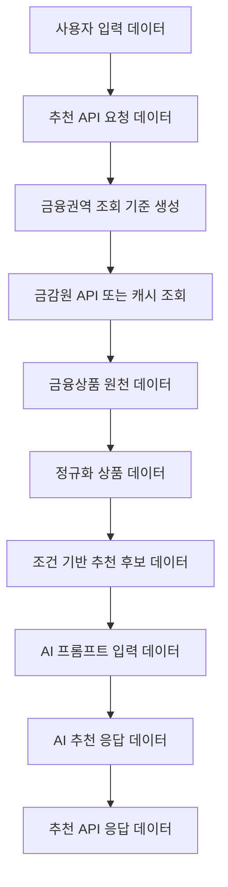

# data-definition.md

# 금융 상품 비교 추천 AI 에이전트 데이터 정의

## 1. 문서 목적

본 문서는 Phase 1에서 사용하는 주요 데이터 구조를 정의한다.

API 명세의 요청/응답 필드를 데이터 관점에서 구체화한다.

금감원 API 원천 응답과 프론트엔드에 제공할 정규화 응답 간 매핑 기준을 정의한다.

백엔드 구현 시 adapter/mapper 계층에서 사용할 기준 문서로 활용한다.

---

## 2. 데이터 설계 기준

| 항목 | 기준 |
|---|---|
| 사용자 입력 저장 | Phase 1에서는 저장하지 않음 |
| 추천 결과 저장 | Phase 1에서는 저장하지 않음 |
| 금융상품 데이터 | 금감원 API 또는 캐시 데이터 기준 |
| 데이터 정규화 | 상품 유형별 원천 응답 차이를 공통 구조로 변환 |
| 금융회사명 | 금감원 API의 `kor_co_nm` 값을 `company_name`으로 매핑 |
| 금융권역 | `preferred_institutions`와 `topFinGrpNo` 기준으로 구분 |
| AI 응답 | 상품 후보와 사용자 조건을 기반으로 생성 |
| 민감정보 | 주민등록번호, 신용점수, 계좌정보 등 수집하지 않음 |
| 금리 데이터 | 숫자값 기준 보관, 화면 표시용 문자열은 필요 시 별도 생성 |
| 날짜/시간 | ISO 8601 문자열 사용 |

---

## 3. 주요 데이터 흐름



`financial_goal`은 사용자 입력 데이터에 포함되며, `AI 프롬프트 입력 데이터` 구성 시 사용자 입력 컨텍스트로 전달된다. 금감원 API 조회 단계에서는 `financial_goal`을 직접 필터링 파라미터로 사용하지 않는다.

---

## 4. 사용자 입력 데이터

`POST /api/phase1/recommendations` 요청 Body 기준으로 작성한다.

```json
{
  "product_type": "saving",
  "age": 29,
  "amount": 500000,
  "saving_period_months": 12,
  "financial_goal": "lump_sum",
  "preferred_institutions": ["bank"]
}
```

| 필드명 | 타입 | 필수 | 설명 | 저장 여부 |
|---|---|---|---|---|
| `product_type` | string | Y | 상품 유형 | 저장 안 함 |
| `age` | number | Y | 사용자 나이 | 저장 안 함 |
| `amount` | number | Y | 상품 유형별 기준 금액 | 저장 안 함 |
| `saving_period_months` | number | N | 가입 또는 이용 기간 | 저장 안 함 |
| `financial_goal` | string | Y | 금융 목적 enum | 저장 안 함 |
| `preferred_institutions` | array | N | 선호 금융권역 | 저장 안 함 |

Phase 1에서는 사용자 입력값을 DB에 저장하지 않는다. 추천 요청 처리 중 메모리에서만 사용하고, 응답 생성 후 별도 보관하지 않는다.

---

## 5. 상품 유형 데이터

| 값 | 화면 표시명 | 설명 |
|---|---|---|
| `deposit` | 예금 | 일정 금액을 일정 기간 예치하는 상품 |
| `saving` | 적금 | 정기적으로 금액을 납입해 목돈을 마련하는 상품 |
| `loan` | 대출 | 필요한 자금을 빌리고 상환하는 상품 |

`product_type`은 백엔드에서 외부 API 호출 대상과 정규화 mapper를 선택하는 기준이다. 예금, 적금, 대출은 금감원 API의 호출 엔드포인트와 응답 구조가 다를 수 있으므로, 백엔드 구현 시 상품 유형별 adapter 또는 mapper를 분리할 수 있다.

---

## 6. 금융 목적 데이터

| 값 | 화면 표시명 | 의미 | 우선 상품 유형 |
|---|---|---|---|
| `lump_sum` | 목돈 마련 | 일정 기간 동안 저축해 목돈을 만들고자 하는 목적 | `saving` |
| `idle_funds` | 여유자금 예치 | 보유 자금을 일정 기간 예치하고자 하는 목적 | `deposit` |
| `living_expenses` | 생활자금 | 생활비 또는 일반 자금 마련 목적 | `loan` |
| `jeonse` | 전세자금 | 전세보증금 또는 주거 관련 자금 마련 목적 | `loan` |
| `emergency` | 비상금 | 단기 비상자금 확보 또는 보관 목적 | `saving` 또는 `deposit` |

`financial_goal`은 금감원 API 필터링 파라미터로 사용하지 않는다. AI 추천 설명의 컨텍스트 입력값으로 전달되며, `product_type`과의 조합이 자연스러운지 판단하는 힌트로 사용한다.

| `product_type` | 적합한 `financial_goal` | 부적합 가능성이 있는 예시 |
|---|---|---|
| `saving` | `lump_sum`, `emergency` | `living_expenses`, `jeonse` |
| `deposit` | `idle_funds`, `emergency` | `living_expenses`, `jeonse` |
| `loan` | `living_expenses`, `jeonse` | `lump_sum`, `idle_funds` |

Phase 1에서는 `product_type`과 `financial_goal` 조합이 다소 불일치하더라도 오류로 차단하지 않는다. 백엔드는 AI 프롬프트에 입력 조건 간 불일치 가능성을 포함하고, AI는 사용자에게 조건을 다시 확인해 볼 수 있도록 안내한다. 강제 차단 또는 자동 상품 유형 전환은 Phase 2 이후 검토한다.

---

## 7. 금융권역 데이터

| 입력값 | 화면 표시명 | 금융권역 | 제1/2금융권 구분 | `topFinGrpNo` | 처리 기준 |
|---|---|---|---|---|---|
| `bank` | 은행 | 은행권 | 제1금융권 | `020000` | Phase 1 기본 조회 |
| `savings_bank` | 저축은행 | 저축은행권 | 제2금융권 | 공식 API 상세 또는 실제 호출 테스트 후 확정 | 선택 옵션 또는 후순위 확장 |
| `all` | 전체 | 은행권 + 저축은행권 | 제1금융권 + 제2금융권 | `020000` + 저축은행 코드 | 복수 조회 필요 |

`preferred_institutions`는 금감원 API 호출 시 사용할 금융권역 조회 기준이다. Phase 1에서는 은행권(`020000`)을 기본 조회 대상으로 한다. `all` 선택 시 은행권과 저축은행권을 순차 조회할 수 있으나, 외부 API 호출 수가 증가하므로 캐시 데이터를 우선 사용한다.

| 값 | 화면 표시명 | 설명 |
|---|---|---|
| `first_sector` | 제1금융권 | 은행권 |
| `second_sector` | 제2금융권 | 저축은행 등 비은행권 |

위 금융권역 enum 값은 `10. 정규화 상품 데이터`의 `financial_sector` 필드값으로 사용한다. 프론트엔드에는 `financial_sector_name`을 화면 표시용 값으로 제공한다.

---

## 8. 금융회사 데이터

| 원천 필드 | 정규화 필드 | 설명 |
|---|---|---|
| `fin_co_no` | `company_code` | 금융회사 코드 |
| `kor_co_nm` | `company_name` | 금융회사명 |
| `topFinGrpNo` | `top_fin_grp_no` | 금융권역 코드 |
| 조회 파라미터 또는 매핑값 | `financial_sector` | 제1/2금융권 구분 |
| 조회 파라미터 또는 매핑값 | `financial_sector_name` | 화면 표시용 금융권역명 |

금융회사명은 금감원 API의 `kor_co_nm` 값을 기준으로 한다. 프론트엔드에는 원천 필드명을 그대로 노출하지 않고 `company_name`으로 정규화해 제공한다.

---

## 9. 금융상품 원천 데이터

금감원 API 원천 응답은 상품 유형별로 필드 차이가 있을 수 있다.

| 데이터 유형 | 설명 | 처리 기준 |
|---|---|---|
| 예금 원천 데이터 | 예금 상품 API 응답 | 예금 mapper에서 정규화 |
| 적금 원천 데이터 | 적금 상품 API 응답 | 적금 mapper에서 정규화 |
| 대출 원천 데이터 | 대출 상품 API 응답 | 대출 mapper에서 정규화 |
| 금융회사 정보 | 금융회사명, 회사 코드 등 | 공통 필드로 매핑 |
| 금리 정보 | 기본 금리, 최고 우대 금리 등 | 숫자값으로 정규화 |
| 가입 정보 | 가입 방법, 가입 기간 등 | 공통 응답 필드로 매핑 |

금감원 API의 원천 필드명은 상품 유형별로 다를 수 있다. Phase 1 백엔드 구현에서는 원천 응답을 프론트엔드에 그대로 전달하지 않고, 정규화 상품 데이터 구조로 변환한 뒤 추천 후보와 응답을 구성한다.

상품 유형별 원천 필드 상세는 금감원 API 실제 호출 테스트 후 별도 보완한다. 특히 예금, 적금, 대출은 엔드포인트와 응답 필드가 다를 수 있으므로, 구현 전 실제 응답 샘플을 기준으로 mapper 필드 매핑표를 보완한다.

---

## 10. 정규화 상품 데이터

```json
{
  "company_code": "0010001",
  "company_name": "예시은행",
  "financial_sector": "first_sector",
  "financial_sector_name": "제1금융권",
  "top_fin_grp_no": "020000",
  "product_code": "P001",
  "product_name": "예시 적금",
  "product_type": "saving",
  "base_rate": 3.2,
  "max_rate": 4.1,
  "period_months": 12,
  "join_way": "인터넷, 모바일",
  "raw_product": {}
}
```

| 필드명 | 타입 | 필수 | 설명 |
|---|---|---|---|
| `company_code` | string/null | N | 금융회사 코드 |
| `company_name` | string | Y | 금융회사명 |
| `financial_sector` | string | Y | 금융권역 enum. 7절 금융권역 데이터의 enum 값을 사용 |
| `financial_sector_name` | string | Y | 화면 표시용 금융권역명 |
| `top_fin_grp_no` | string/null | N | 금감원 API 금융권역 코드 |
| `product_code` | string/null | N | 상품 코드 |
| `product_name` | string | Y | 상품명 |
| `product_type` | string | Y | 상품 유형 |
| `base_rate` | number/null | N | 기본 금리 |
| `max_rate` | number/null | N | 최고 우대 금리 |
| `period_months` | number/null | N | 가입 또는 이용 기간 |
| `join_way` | string/null | N | 가입 방법 |
| `raw_product` | object | N | 원천 응답 보관용 객체. 프론트엔드 응답에는 원칙적으로 포함하지 않음 |

---

## 11. 추천 후보 데이터

추천 후보 데이터는 정규화 상품 데이터에 추천 순위와 추천 기준을 추가한 구조로 정의한다.

```json
{
  "rank": 1,
  "company_name": "예시은행",
  "financial_sector": "first_sector",
  "financial_sector_name": "제1금융권",
  "top_fin_grp_no": "020000",
  "product_name": "예시 적금",
  "product_type": "saving",
  "base_rate": 3.2,
  "max_rate": 4.1,
  "period_months": 12,
  "join_way": "인터넷, 모바일",
  "recommendation_basis": {
    "matched_period": true,
    "matched_institution": true,
    "sort_basis": "max_rate_desc"
  }
}
```

추천 후보 데이터는 `10. 정규화 상품 데이터`의 전체 필드를 포함하며, 아래 필드를 추가로 정의한다.

아래 표는 추천 후보 데이터에서 정규화 상품 데이터에 추가되는 필드만 정의한다.

| 추가 필드명 | 타입 | 설명 |
|---|---|---|
| `rank` | number | 추천 후보 순위 |
| `recommendation_basis` | object | 추천 후보 선정 기준 |
| `matched_period` | boolean | 입력 기간과 상품 기간 일치 여부 |
| `matched_institution` | boolean | 선호 금융권역 일치 여부 |
| `sort_basis` | string | 정렬 기준. 예: `max_rate_desc`, `base_rate_desc` |

추천 후보 데이터는 AI 호출 전 백엔드 내부에서 구성한다. AI에는 전체 원천 데이터가 아니라 추천 후보와 사용자 입력 컨텍스트만 전달한다. Phase 1에서는 AI에 전달하는 추천 후보 수의 기본값을 최대 5개로 한다.

---

## 12. AI 추천 응답 데이터

```json
{
  "summary": "입력하신 조건에서는 12개월 기준의 안정적인 적금 상품을 우선 비교하는 것이 적합합니다.",
  "product_reasons": [
    {
      "rank": 1,
      "recommendation_reason": "월 저축 가능 금액과 12개월 목돈 마련 목적에 비교적 적합한 상품입니다.",
      "cautions": [
        "우대금리 조건 충족 여부를 가입 전 확인해야 합니다.",
        "금리와 상품 조건은 변경될 수 있습니다."
      ]
    }
  ],
  "comparison_points": [
    "최고 우대금리보다 실제 충족 가능한 우대조건을 함께 확인해야 합니다."
  ]
}
```

| 필드명 | 타입 | 설명 |
|---|---|---|
| `summary` | string/null | AI 추천 요약 |
| `product_reasons` | array | 상품별 추천 사유 |
| `rank` | number | 추천 후보 순위. 11. 추천 후보 데이터의 `rank`와 매핑 키로 사용 |
| `recommendation_reason` | string/null | 상품별 추천 이유 |
| `cautions` | array | 상품별 유의사항 |
| `comparison_points` | array | 상품 간 비교 포인트 |

AI 추천 응답은 금융상품 원천 데이터를 새로 생성하지 않고, 백엔드가 전달한 추천 후보에 대한 설명만 생성한다. AI가 생성한 설명은 백엔드에서 추천 후보 데이터와 결합해 최종 API 응답을 구성한다.

`product_reasons`의 각 객체는 `rank`를 기준으로 추천 후보 데이터와 결합한다. AI는 상품명이나 금융회사명을 새로 생성하지 않고, 백엔드가 전달한 추천 후보의 `rank`에 대해 추천 사유와 유의사항만 작성한다.

AI 응답 파싱 실패 시 `summary`, `product_reasons`, `comparison_points`는 null 또는 빈 배열로 처리하고, `api-spec.md`의 `partial_success` 응답 구조를 따른다.

---

## 13. 오류 응답 데이터

```json
{
  "status": "error",
  "error_code": "VALIDATION_ERROR",
  "message": "필수 입력값을 확인해 주세요.",
  "details": [
    {
      "field": "product_type",
      "reason": "상품 유형은 필수입니다."
    }
  ]
}
```

| 필드명 | 타입 | 설명 |
|---|---|---|
| `status` | string | 오류 상태. `error` |
| `error_code` | string | 오류 코드 |
| `message` | string | 사용자 표시용 오류 메시지 |
| `details` | array | 상세 오류 정보 |

| `error_code` | 설명 |
|---|---|
| `VALIDATION_ERROR` | 필수값 누락 또는 입력값 형식 오류 |
| `INVALID_PRODUCT_TYPE` | 지원하지 않는 상품 유형 |
| `NO_RECOMMENDABLE_PRODUCTS` | 조건에 맞는 상품 없음 |
| `FINANCIAL_API_ERROR` | 금융상품 데이터 조회 실패 |
| `OPENAI_API_ERROR` | AI 추천 설명 생성 실패 |
| `INTERNAL_SERVER_ERROR` | 서버 내부 오류 |

---

## 14. 캐시 데이터 기준

- Phase 1에서는 파일 캐시 또는 단순 메모리 캐시를 우선 검토한다.
- 캐시 데이터는 금융상품 원천 응답 또는 정규화 상품 데이터 형태로 보관할 수 있다.
- 프론트엔드에는 캐시 여부보다 데이터 출처와 조회 시점이 중요하다.
- API 응답의 `source.fetched_at`에는 데이터 조회 또는 캐시 기준 시점을 포함한다.
- `preferred_institutions: ["all"]`처럼 복수 금융권역 조회가 필요한 경우 캐시 사용을 우선한다.
- Phase 1에서는 캐시 만료 기준을 24시간으로 기본 설정한다.
- 금리와 상품 조건은 변경될 수 있으므로 캐시 데이터 사용 시 `source.fetched_at`을 함께 표시한다.
- 사용자는 최종 가입 전 금융회사와 금융감독원 공시 정보를 다시 확인해야 한다.

```json
{
  "source": {
    "provider": "금융감독원 금융상품통합비교공시 API",
    "fetched_at": "2026-05-13T10:00:00+09:00",
    "expires_at": "2026-05-14T10:00:00+09:00",
    "cache_used": true
  }
}
```

`expires_at`은 Phase 1 기본 캐시 만료 기준인 24시간을 적용해 계산한다. 실제 구현 시 캐시 갱신 정책은 Render Free 티어 제약과 외부 API 호출량을 고려해 조정할 수 있다.

---

## 15. 저장 제외 데이터

| 데이터 | 저장 제외 사유 |
|---|---|
| 사용자 나이 | 개인화 저장 기능 없음 |
| 사용자 금액 입력값 | 민감할 수 있는 개인 재무 정보 |
| 금융 목적 | 추천 요청 처리 중에만 사용 |
| 추천 결과 | Phase 1에서는 히스토리 기능 없음 |
| AI 응답 원문 | 비용/로그/개인정보 관리 범위 초과 |
| 주민등록번호 | 수집 대상 아님 |
| 신용점수 | 수집 대상 아님 |
| 계좌정보 | 수집 대상 아님 |

---

## 16. 후속 구현 참고 사항

- `api-spec.md`의 요청/응답 구조와 필드명이 일치해야 한다.
- 외부 API 원천 필드는 상품 유형별 mapper에서 정규화한다.
- `company_name`은 `kor_co_nm`을 기준으로 매핑한다.
- `financial_sector`는 `topFinGrpNo` 또는 조회 파라미터 기준으로 매핑한다.
- `financial_goal`은 AI 프롬프트 컨텍스트로 사용하고 금감원 API 필터링에는 사용하지 않는다.
- `risk_preference`는 Phase 1 데이터 구조에 포함하지 않는다.
- Phase 1에서는 DB 테이블 설계를 최소화하고, 필요 시 캐시 파일 또는 메모리 캐시부터 검토한다.
- `raw_product`는 디버깅 목적의 내부 데이터이며 프론트엔드 응답에는 원칙적으로 포함하지 않는다.
- 상품 유형별 원천 필드 상세는 실제 API 호출 테스트 후 보완한다.
- AI에 전달하는 추천 후보 수는 Phase 1 기본값 최대 5개로 한다.
- AI 응답 파싱 실패 시 `api-spec.md`의 `partial_success` 기준을 따른다.
- 추천 후보 데이터는 정규화 상품 데이터 전체 필드를 포함하고, `rank`와 `recommendation_basis`를 추가한 구조로 구성한다.
- AI 추천 응답의 `product_reasons.rank`는 추천 후보 데이터의 `rank`와 매핑해 최종 응답을 결합한다.
- Phase 1 캐시 만료 기준은 기본 24시간으로 설정하되, 실제 구현 시 외부 API 호출량과 배포 환경을 고려해 조정할 수 있다.
- `financial_goal`은 AI 프롬프트 입력 데이터에 포함되지만 금감원 API 조회 파라미터로는 사용하지 않는다.
